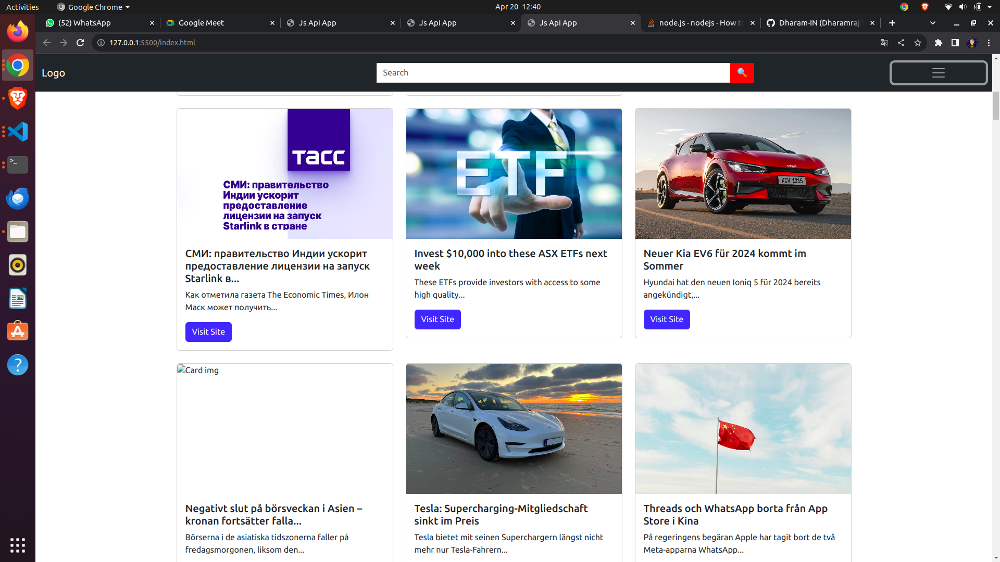

# Instagram Login Clone Project

## Description

This project is a basic News App created using Vanila Javascript. It aims to provide a news.
## Features

- User Read News and visit main website where have news

## Installation
1. Clone the repository to your local machine:

git clone https://github.com/Dharam-IN/JavascriptApiNewsApp

## Technologies Used

- Html
- CSS
- Bootstrap
- Javascript

## Preview

## How to Run

1. Clone this repository.
2. Navigate to the project directory.
3. Open VS Code and Click Go Live.

## Author

Created with passion by [Dharam IN](https://github.com/Dharam-IN)

## License

This project is licensed under the MIT License - see the [LICENSE](LICENSE) file for more details.
